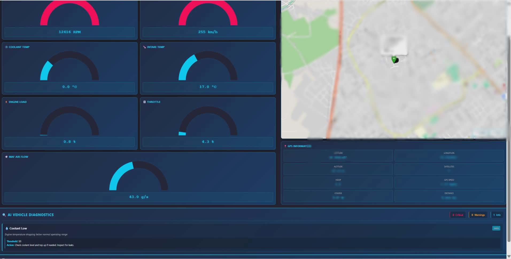
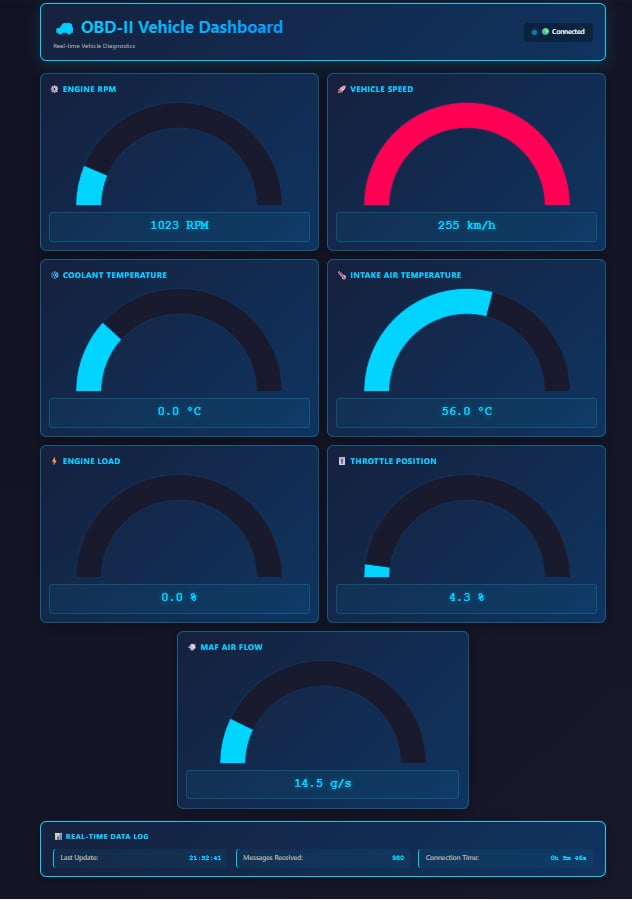
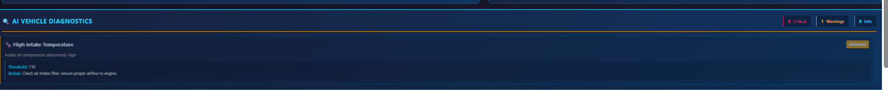
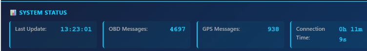

# 🚗 Vehicle OBD-II + GPS Diagnostic Dashboard
## Complete IoT Vehicle Monitoring System with AI Fault Detection



---

## 📋 Project Overview
The Vehicle OBD-II + GPS Diagnostic Dashboard is a real-time IoT vehicle monitoring system that integrates engine diagnostics and GPS tracking. An ESP32 microcontroller simultaneously reads engine data from the vehicle's OBD-II port (via MCP2515 CAN module at 125 kbps) and GPS coordinates from a NEO-6M module (9600 baud). The processed data is transmitted via WiFi to a Mosquitto MQTT broker, which publishes seven engine metrics (RPM, speed, coolant, load, throttle, MAF, intake temp) and seven GPS parameters (latitude, longitude, altitude, satellites, HDOP, speed, course) to separate MQTT topics every 1-5 seconds.

On the client side, a web dashboard subscribes to these real-time data streams via WebSocket, displaying seven animated gauges with color-coded severity levels (cyan=normal, orange=warning, red=critical), an interactive Leaflet map showing live vehicle location with route history, and GPS information cards. An embedded AI diagnostics engine continuously analyzes the data against 12+ problem detection rules, identifying critical issues (overheating, high load), warnings (MAF faults, unstable idle, transmission slip), and informational alerts (low coolant, fuel consumption). Detected problems appear instantly in a dedicated panel with severity colors, threshold values, and recommended actions.

This integrated system transforms raw automotive data into actionable intelligence, providing comprehensive vehicle health monitoring comparable to professional diagnostic tools used by manufacturers and fleet management companies—ideal for automotive students, technicians, and IoT enthusiasts.

This is a **comprehensive automotive IoT project** that combines:
- ✅ **OBD-II CAN Bus Diagnostics** - Real-time engine parameters (RPM, coolant, load, throttle, MAF)
- ✅ **GPS Vehicle Tracking** - Live location, distance traveled, route history
- ✅ **AI Fault Detection** - Intelligent problem identification and recommendations
- ✅ **Professional Web Dashboard** - Real-time data visualization with interactive maps
- ✅ **MQTT Communication** - Reliable data transmission via Mosquitto broker


## 📋 Project Evolution: From Simulator to Real Vehicle

### **Phase 1: Current State (Simulator-Based Testing)**

The Vehicle OBD-II + GPS Diagnostic Dashboard system is **designed to be mounted directly on real vehicles** via physical cables connected to the **OBD-II diagnostic port** using dedicated **CANH and CANL pins** through an **MCP2515 CAN module**. However, since the project is currently in its **early development phase**, we have developed a **comprehensive hardware-in-loop simulator** that replicates real vehicle behavior without requiring direct vehicle access.

This simulator architecture consists of **three integrated layers**:

1. **Data Generation Layer (PC-Based)**
   - Python script generates realistic OBD-II sensor values
   - Simulates authentic driving patterns (idle, acceleration, cruising, braking)
   - Creates time-series data that mirrors real engine behavior
   - Can output to serial stream or SD card CSV files

2. **CAN Encoding Layer (Arduino Sender)**
   - Arduino board receives generated data via serial connection from the PC
   - Parses incoming CSV-formatted strings (RPM, speed, coolant, etc.)
   - Encodes parsed values into standard OBD-II Protocol IDs (PIDs)
   - Transmits encoded data as CAN messages (125 kbps) via MCP2515 CAN module

3. **CAN Reception Layer (ESP32 Receiver)**
   - Second MCP2515 module (connected to ESP32) receives CAN messages from the sender
   - Decodes CAN frames back into individual sensor parameters
   - Publishes decoded values to MQTT topics (identical to real vehicle implementation)
   - Feeds data to web dashboard and AI diagnostics engine

This **complete end-to-end simulation** validates that when the system transitions to a real vehicle, the **same ESP32 firmware and web dashboard code will function identically**—the only difference being that live CAN data comes from the vehicle's diagnostic port instead of the simulator.

---

## 🛠️ Hardware Architecture

### **Components Required:**

| Component | Cost | Purpose |
|-----------|------|---------|
| **ESP32 DevKit** | $12 | Main microcontroller (WiFi + UART) |
| **MCP2515 CAN Module** | $8 | Read OBD-II CAN bus data |
| **NEO-6M GPS Module** | $18 | Real-time location tracking |
| **OBD-II Adapter** | $15 | Connect to vehicle's diagnostic port |
| **Mosquitto MQTT Broker** | FREE | Message relay (software) |
| **Wires & Connectors** | $5 | Circuit assembly |
| **USB Cable** | $3 | Programming & power |


### **File Descriptions:**

| File | Type | Purpose | Size |
|------|------|---------|------|
| `ESP32_OBD2_GPS_Combined.ino` | Arduino | Firmware for ESP32 microcontroller | - |
| `DIAG.html` | HTML | Web dashboard interface | 7 KB |
| `diagnostics.js` | JavaScript | AI anomaly detection & problem identification | 10 KB |
| `scriptDIAG.js` | JavaScript | MQTT data reception & map updates | 15 KB |
| `styleDIAG.css` | CSS | Dark professional theme styling | 11 KB |
| `audi_obd_data.csv` | Data | OBD-II parameter definitions & ranges | 141 KB |
| `db_communicate.py` | Python | Optional database logging script | 2 KB |
| `mosq.conf` | Config | Mosquitto MQTT broker settings | 1 KB |

---

## 🎯 Dashboard Features

### **1. OBD-II Engine Diagnostics Panel** ⚙️



**7 Real-Time Gauges:**
**Gauge Colors:**
- 🔵 **Cyan** (0-80%) - Normal operating range
- 🟠 **Orange** (80-95%) - Warning zone
- 🔴 **Red** (95-100%) - Critical/Danger zone

---

### **2. GPS Location Tracking** 📍
**Interactive Leaflet Map featuring:**


---

### **3. Vehicle Diagnostics** 🤖


**Intelligent Problem Detection (10+ Conditions):**



#### **Critical Issues (🔴 RED - STOP ENGINE)**
1. **Engine Overheating** - Coolant > 120°C
   - Action: Stop engine, check coolant, radiator
   
2. **Critical Engine Load** - Load > 90%
   - Action: Reduce load immediately, check transmission

#### **Warnings (🟠 ORANGE - CAUTION)**
3. **High Intake Temperature** - Intake > 110°C
   - Action: Check air filter, ensure airflow

4. **High Engine Load** - Load 75-90%
   - Action: Monitor, avoid prolonged high-load

5. **MAF Sensor Issues** - RPM-dependent anomalies
   - Action: Clean or replace MAF sensor

6. **Throttle Anomaly** - High throttle, low speed
   - Action: Check throttle cable, pedal sensor

7. **Engine Misfire** - RPM variation > 500
   - Action: Check spark plugs, fuel injectors

8. **Unstable Idle** - RPM fluctuation > 300 at idle
   - Action: Clean injectors, check idle control

9. **Transmission Issues** - High RPM, low speed
   - Action: Check fluid level & condition

10. **Low Battery** - Voltage < 12V
    - Action: Get battery tested/replaced

#### **Information (🔵 CYAN - FYI)**
11. **Low Coolant** - Coolant < 50°C
    - Action: Check level, inspect for leaks

12. **High Fuel Consumption** - High MAF + high load
    - Action: Reduce acceleration, check tire pressure
---

### **4. System Status Panel** 📊



---


### ** Software Installation (15 minutes)**


```bash
# 1. Install Arduino IDE
# Download: https://www.arduino.cc/en/software

# 2. Add ESP32 Board Support
# Tools → Board Manager → Search "esp32" → Install

# 3. Install Required Libraries
# Sketch → Include Library → Manage Libraries
# Install:
#   - TinyGPSPlus
#   - PubSubClient
#   - mcp2515 (MCP2515)
#   - ArduinoJson (optional)

# 4. Install Mosquitto MQTT Broker
# Windows: https://mosquitto.org/download/
# Linux: sudo apt-get install mosquitto

# 5. Clone/Download Project
git clone https://github.com/basilus00/Vehicle_CAN_Diagnostic_project.git
cd Vehicle_CAN_Diagnostic_project

```
## Final notes
this is just a simple trial to understand and develop an auto diagnostic system waiting to develop it further in the futur 
(created by a first year Automotive Software Engineering Student)
Be free to use it and enhance it as you like.
